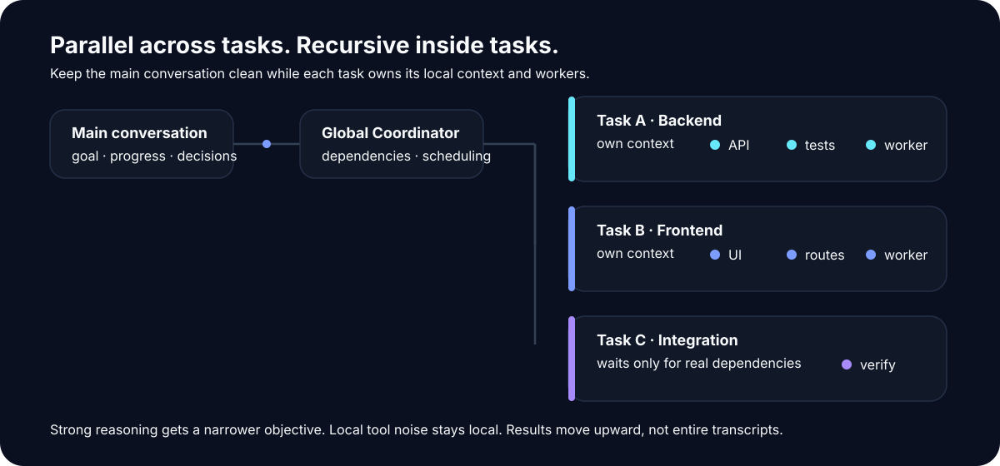
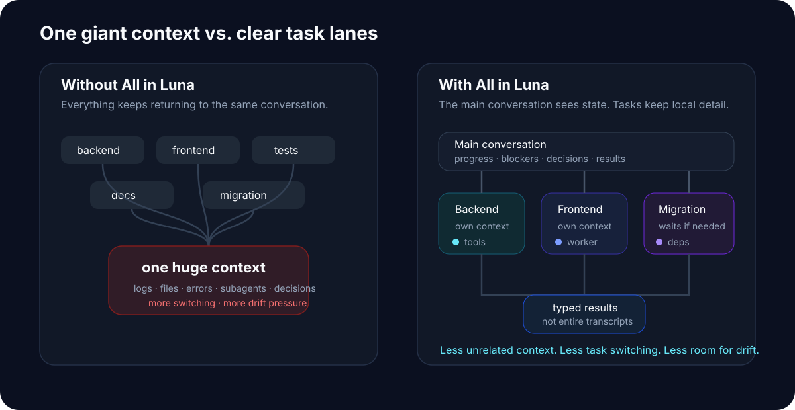
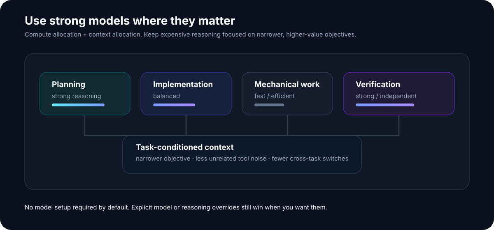

# All in Luna

[English](README.en.md)

<p align="center">
  
</p>

> **别再把整个项目塞进一个 AI 对话里。**

给 All in Luna 一个大目标。

它会把工作拆成几个真正独立的顶层任务：**能并行的同时推进，有依赖的自动等待，每个任务维护自己的上下文，最后再把结果汇总回来。**

每个任务内部仍然可以继续调用自己的 subagent、工具、Skill 或 MCP。

**任务之间并行，任务内部递归。**

<p align="center">
  
</p>

---

## 为什么需要它？

让 AI 做一个小修改很简单。

真正麻烦的是这种任务：

> “把 Authentication 完整重构掉，包括后端、前端、迁移、测试和文档。”

一开始通常都很好。

然后 AI 开始读文件、改代码、跑测试、调用 subagent、处理失败、重新读文件，再把越来越多的执行细节塞回同一个 conversation。

几十轮之后，常见的问题开始出现：

- 上下文越来越长；
- 不同工作互相污染；
- 前面的约束逐渐被遗忘；
- 一个局部 blocker 卡住整个流程；
- subagent 的结果很难继续管理；
- 换个会话以后，不知道之前真正做到哪里；
- AI 说“完成了”，但结果未必真的完整。

**All in Luna 的核心想法很简单：不要让一个 conversation 承担整个项目。**

<p align="center">
  
</p>

---

## One more layer above subagents

普通 agent 工作流通常是：

```text
You
 │
 ▼
Main Agent
 ├─ subagent
 ├─ subagent
 └─ subagent
```

All in Luna 在 subagent 上面增加了一层真正的 **Top-level Task**：

```text
You
 │
 ▼
All in Luna
 │
 ├─ Top-level Task A
 │    ├─ local work
 │    └─ subagents / tools / Skills
 │
 ├─ Top-level Task B
 │    ├─ local work
 │    └─ subagents / tools / MCPs
 │
 └─ Top-level Task C
      └─ waits only when it actually depends on A
```

**Top-level Task 不是另一个 subagent。**

它是一块独立的工作域，拥有自己的目标、上下文、依赖、工作状态、局部执行过程和结果边界。

subagent 则是某个 Task 内部需要进一步拆分工作时使用的局部 worker。

> **All in Luna 不替代 subagent，而是给 subagent 一个正确的层级。**

---

# What you get

## 1. Real top-level tasks

一个复杂目标可以被拆成真正独立的工作域，而不是一组临时聊天分支。

例如：

```text
Add billing to this app

├─ Billing backend
├─ Checkout UI
├─ Database migration
├─ Integration tests
└─ Documentation
```

每个任务可以独立推进、等待依赖、产生结果，并拥有自己的工作上下文。

## 2. Parallel when possible

没有依赖的工作不需要排队。

```text
Billing backend       ● running
Checkout UI           ● running
Documentation         ● running
Database migration    ○ waiting for schema
Integration tests     ○ waiting for backend
```

**One blocked task doesn't freeze unrelated work.**

## 3. Separate working contexts

后端调试不需要和前端修改、测试日志、文档和发布工作全部挤在同一个上下文里。

主对话应该主要看到：

```text
✓ what is done
● what is running
○ what is waiting
! what needs your decision
```

文件读取、终端输出、测试日志、diff 和大量实现细节可以留在产生它们的 Task 内部。

**你的主对话不需要成为整个项目的日志文件。**

## 4. Recursive local workers

一个 Top-level Task 如果自己仍然很复杂，可以继续拆成 WorkUnits 或调用 subagents。

```text
Backend Task
 ├─ API
 ├─ database changes
 ├─ tests
 └─ migration checks
```

局部复杂度留在局部。

**Parallel across tasks. Recursive inside tasks.**

## 5. Resume instead of restarting

All in Luna 会保存运行状态、任务状态、依赖和结果。

复杂工作不必永远依附于某一个越来越长的 conversation。

```text
start
→ work
→ stop
→ come back
→ resume
```

已经完成的事情不需要再靠聊天记忆重新猜一遍。

## 6. Verify before “done”

Agent 说：

> “Done.”

并不代表任务真的完成。

All in Luna 可以根据实际工作检查测试、构建结果、文件变化、artifacts 和声明的输出，再决定任务是否应该被接受为完成。

## 7. Bring your own workflow

All in Luna 不是一条固定 workflow。

默认可以直接完成普通 delivery 工作。

需要更详细的软件开发流程时，可以在某个 Task 中使用 **GSD**。

科研工作可以连接 **Research Routes**。

Task 也可以继续使用其他 Skill、MCP、工具或宿主能力。

**Core 负责运行复杂工作，而不是规定所有工作应该怎么思考。**

---

# Example

假设你说：

> **“把这个应用的 Authentication 系统完整重构掉，包括后端、前端、迁移和测试。”**

All in Luna 可以把它组织成：

```text
Authentication refactor

├─ Task 1 — Auth backend
│    ├─ session/token logic
│    ├─ API
│    └─ backend tests
│
├─ Task 2 — Frontend auth flow
│    ├─ login
│    ├─ logout
│    └─ protected routes
│
├─ Task 3 — Migration
│    └─ waits for auth contract
│
└─ Task 4 — Integration
     └─ waits for backend + frontend
```

Task 1 和 Task 2 可以同时推进。

Task 1 如果仍然复杂，可以继续使用自己的 subagent。

Task 3 只等待它真正需要的结果。

而你不需要在主 conversation 里同时追踪四条工作的全部实现细节。

---

# When should I use it?

All in Luna 特别适合：

- 大型 feature；
- 跨 frontend / backend / tests / docs 的工作；
- 大型 refactor；
- migration；
- 多个可以独立推进的结果；
- 长时间运行的 coding session；
- 一个 blocker 不应该停止整个项目；
- 不同任务需要不同工具、模型或 workflow；
- 希望后续可以恢复，而不是依赖聊天历史。

如果只是改一个 typo、解释一个函数、调整一处 CSS 或完成一个很小的线性任务，直接使用当前 Agent 通常更快。

**All in Luna 解决的是复杂工作的组织问题，不是让简单工作变复杂。**

---

# Models & performance

<p align="center">
  
</p>

## 不配置也可以

大多数用户不需要配置模型。

如果你没有指定，All in Luna 会使用当前环境、宿主或部署策略能够提供的资源。

它不要求所有用户使用某个固定模型或厂商。

## 想控制也可以

不同类型的工作，不一定值得使用同样昂贵的推理资源。

例如：

```text
Planning        → stronger reasoning
Implementation  → balanced
Mechanical work → fast / efficient
Verification    → strong / independent
```

> **把强推理留给真正需要强推理的地方。**

更进一步，All in Luna 不只是分配计算资源，也把问题本身分得更干净：强模型可以面对更窄、更稳定的目标，减少无关上下文和跨任务切换带来的漂移空间。

**Less unrelated context. Less task switching. Less room for drift.**

常见的使用方式包括：

- **Balanced**：适合绝大多数项目，让当前环境按任务角色使用合理资源；
- **Quality first**：大型架构改动、困难 debugging、高风险重构和研究任务；
- **Efficient**：强推理主要留给顶层分解、困难 blocker、综合和最终验证；
- **Single model**：希望整个 run 尽量使用当前选择的同一个模型。

这些是资源策略的使用模式，而不是 Core 写死的模型列表。高级用户仍然可以覆盖具体 Task 或 WorkUnit 使用的模型与 reasoning。

详见 [Models & performance](docs/user/models-and-performance.md)。

---

# Workflow Packs

All in Luna 的 Core 负责：

```text
top-level tasks
dependencies
scheduling
context
results
recovery
```

一个 Task 内具体采用什么工作方法，则可以交给不同的 Workflow Pack。

### Delivery

默认的软件交付路径。

适合 feature、bug fix、refactor、migration 和 integration。

### GSD

需要更完整的软件开发流程时，可以使用：

```text
clarify
→ specify
→ decompose
→ implement
→ verify
→ integrate
```

GSD 和 All in Luna 工作在不同层级。

**GSD 可以运行在某个 All in Luna Top-level Task 内部。**

### Research Routes

用于保留 Claims、Evidence、unknowns、contradictions、experiments 和 research route changes。

研究判断不会自动变成 implementation authorization。

---

# How is it different?

| | Subagents | GSD | All in Luna |
|---|---:|---:|---:|
| Split local work | ✓ | ✓ | ✓ |
| Detailed development workflow | — | ✓ | Optional |
| Independent top-level tasks | — | — | **✓** |
| Top-level dependency scheduling | — | — | **✓** |
| Separate context per top-level task | Limited | Phase-oriented | **✓** |
| Local workers inside each task | ✓ | ✓ | **✓** |
| Pluggable workflows | — | — | **✓** |
| Persistent run / recovery | Depends | Depends | **✓** |

核心区别不是谁能创建更多 Agent。

> **All in Luna 把 Top-level Task 本身变成运行时的一等对象。**

### What about Sol Advisor?

Sol Advisor 风格更接近：

```text
Strong Primary Architect
→ bounded implementation / review workers
```

All in Luna 把 orchestration boundary 再往上一层：

```text
Global Coordinator
→ multiple persistent Top-level Tasks
→ each Task has its own workflow and workers
```

两者关注的是不同抽象层，而不是简单的替代关系。

---

# Quickstart

## Vibe coding

安装 All in Luna 后，最简单的使用方式就是直接说：

```text
Use All in Luna to finish the authentication refactor.
Keep independent parts moving in parallel where possible.
```

或者：

```text
用 All in Luna 完整完成这个项目。
能独立推进的部分尽量并行。
```

就这样。

你不需要先写 TaskGraph、选择 scheduler、设计 agent hierarchy 或填写资源问卷。

## CLI

需要显式查看和控制 run 时：

```bash
python -m pip install -e .

allinluna start --goal "Finish the authentication refactor"
allinluna status RUN_ID
allinluna drive RUN_ID
```

查看全部命令：

```bash
allinluna --help
```

Lane、direct-work、recovery 和诊断命令放在高级 CLI 文档中。

---

# Permissions

启动一个 run 不代表 All in Luna 自动获得所有外部权限。

只有真正执行到相应动作时，才需要处理：

- push；
- merge；
- deploy；
- publish；
- credentials；
- destructive operations；
- live external mutations。

普通本地探索和任务组织不需要先填写一个巨大的权限问卷。

---

# Design philosophy

**Keep the Core small.**  
顶层调度、上下文、协议和恢复属于 Core；具体 workflow 属于 Pack。

**Protocols instead of management theater.**  
正确性应该尽量由运行时合同保证，而不是再创造一层 Reviewer / Auditor / Manager Agent。

**Keep local complexity local.**  
一个 Task 的工具噪声和局部 worker 不应该污染整个项目。

**Stay model-neutral.**  
Core 描述需要什么能力，而不是规定所有用户必须使用什么模型。

**Leave room for the user.**  
All in Luna 负责把复杂工作运行起来，不替用户私自扩大目标。

---

# Documentation

### Start here

- [Quickstart](docs/user/quickstart.md)
- [Inputs & journeys](docs/user/input-and-journeys.md)
- [Models & performance](docs/user/models-and-performance.md)
- [Example](docs/examples/plain-goal.md)

### Go deeper

- [Troubleshooting](docs/troubleshooting/common-issues.md)
- [Public runtime surface](docs/architecture/public-surface.md)
- [Architecture](docs/architecture/)
- [Brand guide](docs/brand/BRAND.md)

---

# Release

查看 GitHub Releases 和 Changelog 获取当前版本、升级说明和已知限制。

---

# License

Apache License 2.0 — see [LICENSE](LICENSE).
